# MERN Stack-JobPortal 🚀  
A full-stack **Job Portal** application built using the **MERN stack (MongoDB, Express.js, React.js, Node.js)**. This project allows job seekers to find and apply for jobs, while employers can post job listings and manage applications.  


## 🔥 Features  
✅ User Authentication (JWT) - Job Seekers & Employers  
✅ Job Listings with Filters (Category, Location, Salary)  
✅ Resume Upload & Job Applications  
✅ Employer Dashboard - Manage Job Posts & Applications  
✅ Admin Panel for User & Job Management  
✅ Secure REST APIs & Database Integration  
✅ Modern UI with **React.js & Tailwind CSS**  

## 🛠️ Tech Stack  
- **Frontend:** React.js, Redux, Tailwind CSS  
- **Backend:** Node.js, Express.js, MongoDB, JWT  

## 🚀 Installation & Setup  
### 1️⃣ Clone the Repository  
```bash  
git clone https://github.com/helloujjwall/MERN-JobPortal.git  
cd MERN-JobPortal  
```  
### 2️⃣ Install Dependencies  
```bash  
# Install backend dependencies  
cd backend  
npm install  

# Install frontend dependencies  
cd ../frontend  
npm install  
```  
### 3️⃣ Setup Environment Variables  
Create a `.env` file in the `backend` folder and add the following:  
```env  
MONGO_URI=mongodb+srv://<USERNAME>:<PASSWORD>@<CLUSTER>.mongodb.net/<DB_NAME>
PORT=8080
SECRET_KEY=<YOUR_SECRET_KEY>
CLOUD_NAME=<YOUR_CLOUD_NAME>
API_KEY=<YOUR_API_KEY>
API_SECRET=<YOUR_API_SECRET> 
```  

### 4️⃣ Run the Project  
```bash  
# Start the backend server  
cd backend  
npm run dev  

# Start the frontend server  
cd ../frontend  
npm run dev  
```  

## 📌 To-Do (Under Development)  
- [ ] User Authentication (In Progress)  
- [ ] Job Posting & Search Features  
- [ ] Employer Dashboard & Job Applications  
- [ ] Admin Panel  


## 📸 Screenshots

### 🏠 Home Page
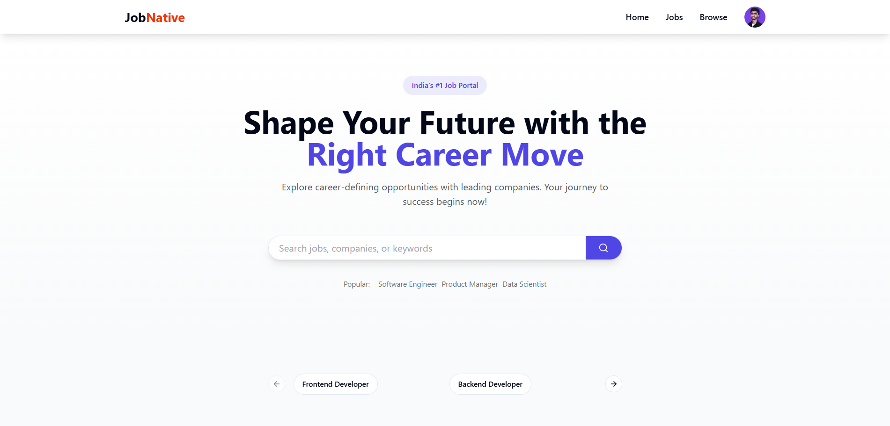

### 💼 Featured Jobs
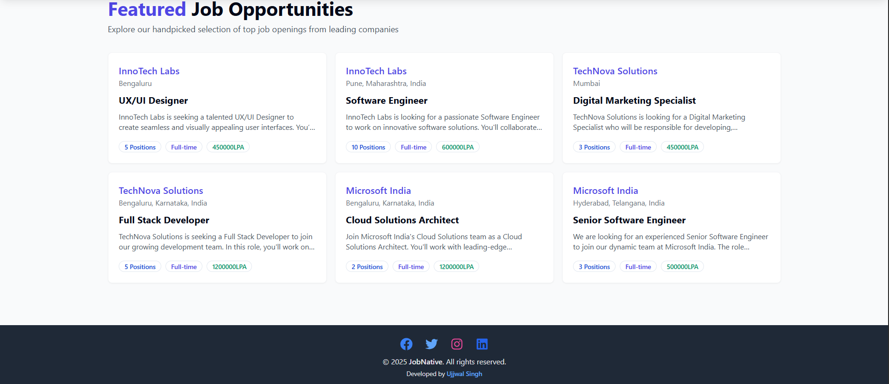

### 🔐 Login Page
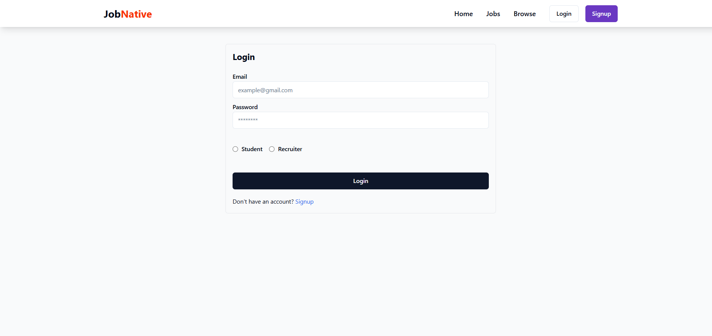

### 📝 Signup Page
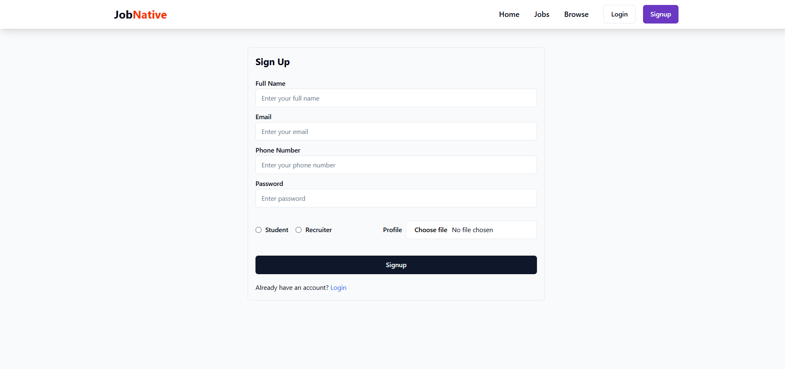

### 📋 Jobs Page
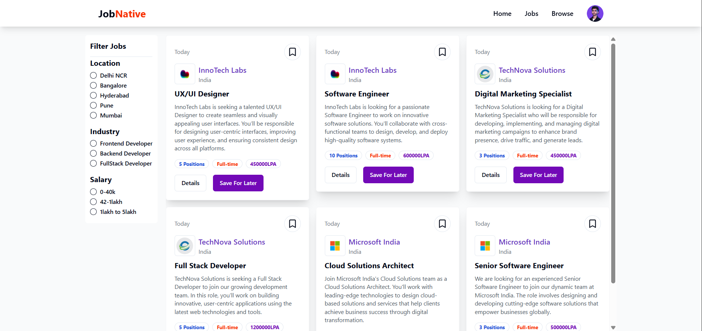

### 🔍 Browse Page
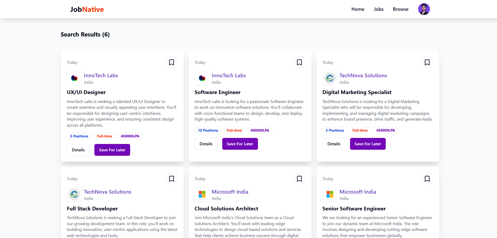

### 👤 Profile Page


### ⚡ Popup Page
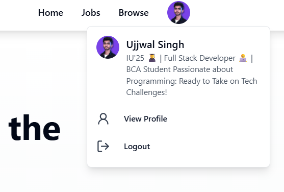

### 🏢 Admin Companies Page
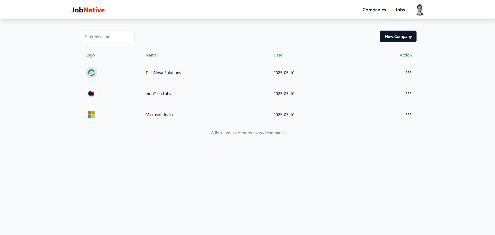

### 📊 Admin Jobs Page
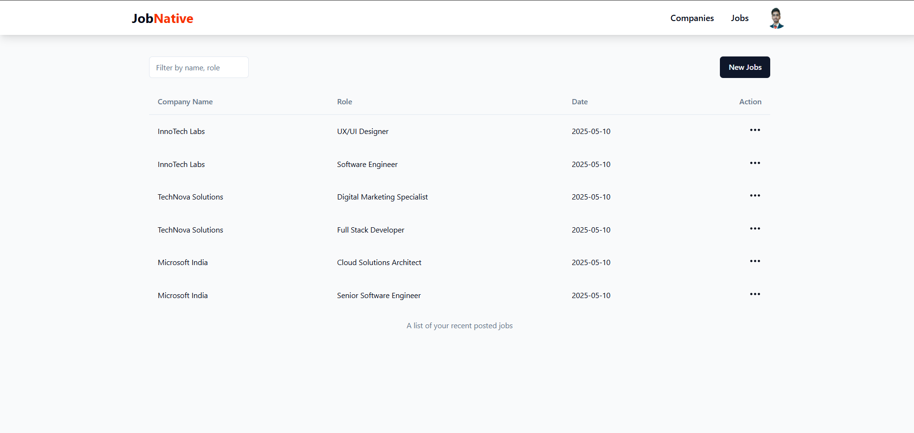

### 🏗️ Create Company Page
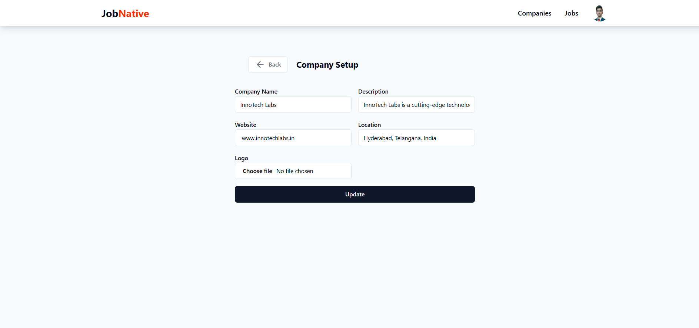

### ✏️ Create Jobs Page
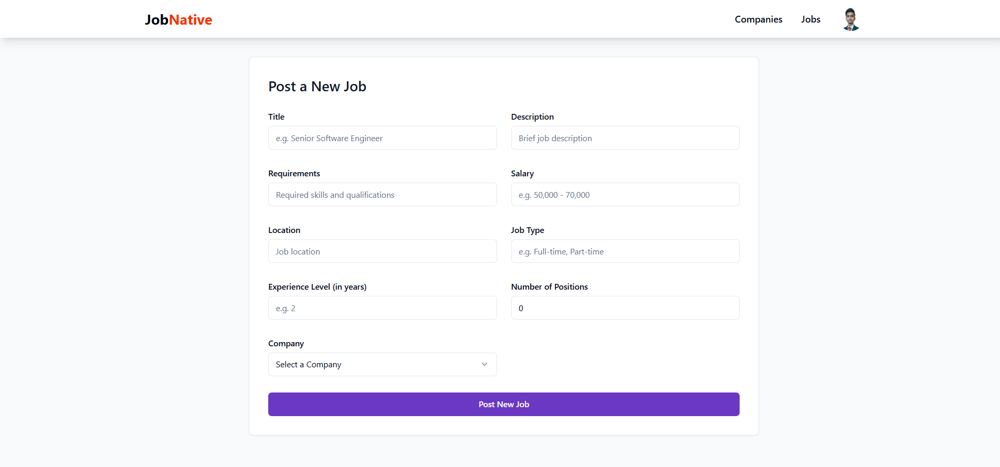


## 🌍 Live Demo  
Coming Soon...
